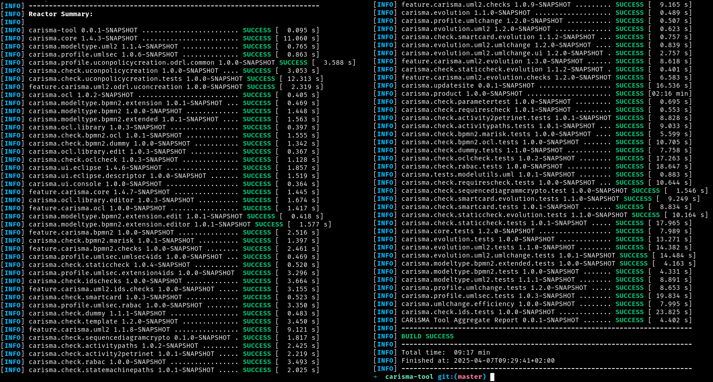
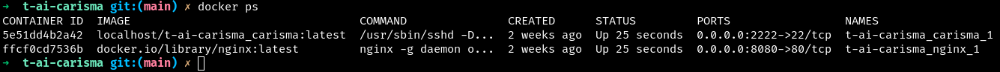

# Trustworthy AI: algorithm assessment BB – CARiSMA

CARiSMA is a comprehensive open source software suite that enables system designers and security experts to perform automated compliance analyses, risk analyses and security analyses of software and system models. This allows users to consider security requirements early in the development process. Unified Modelling Language (UML) models are annotated with security-specific requirements that can be tailored to the users’ needs to cover a wide range of topics. Checks are performed on UML models, analyzing the models against the specified requirements and providing the user with detailed feedback on the models' compliance with the previously defined requirements.

## Design Document
See the design document [here](docs/).

## Building instructions

Checkout this repository and its submodule(s) with:

```bash
git clone git@github.com:Prometheus-X-association/t-ai-carisma.git
cd t-ai-carisma
git submodule init
git submodule update
```

Then build the two containers (carisma + dataspace-connector + mongodb) with:

```bash
docker compose build
```

## Running instructions

Copy `.env.sample` file to `.env` and adjust the values. Create an authorized_keys file that contains public SSH keys of users that should be allowed to connect to CARiSMA. Copy PDC sample configuration to production configuration. Start the containers:

```bash
cp <your-authorized_keys> ./volumes/authorized_keys
docker compose up
```

To launch CARiSMA in the container on the docker host and use the GUI on your local host, connect to the carisma container from your local host via SSH (by default the container's SSH daemon is mapped to port 2222 of the docker host) with X11 forwarding enabled:

```bash
ssh -X -p 2222 root@<docker-host> /opt/carisma/carisma-launcher
```

Since the GUI is sent over network, performance depends on the connection quality between docker host and local host.

## Example usage

CARiSMA stores check reports in a machine readable format into a folder, which is provided by nginx.

Send the following requests to the designated endpoints (without further setup, it's on http://localhost:8080/ ) to retrieve sample reports:

| Endpoint                                          | Example input | Expected output  |
|---------------------------------------------------|---------------|------------------|
| /reports/a63868ef-634d-4f66-8f34-068e9fd17a0e.xml | none          | dummy XML report |
| /reports/c7f2581f-fc9a-4441-9cd0-ed97b46a5dc3.xml | none          | dummy XML report |


## Unit testing
The unit tests verify the internal correctness of the CARiSMA Tool and implemented checks as far as tests exist. The tests are implemented as jUnit class tests that make use of a headless Eclipse environment, where necessary. Apache Maven is used to execute all unit tests in batch.


### Setup test environment
```bash
git clone git@github.com:Prometheus-X-association/t-ai-carisma.git
cd t-ai-carisma
git submodule init
git submodule update
```

### Run tests
```bash
cd carisma-tool
./mvnw clean verify # on Windows use 'mvnw.exe clean verify'
```

### Expected result
After a while, the output should state "BUILD SUCCESS" in green:



You can analyze test results and coverage by opening the following file in your browser: `report-aggregate-module/target/site/jacoco-aggregate/index.html`.

## Component-level testing
Component level testing the desktop application CARiSMA in the context of Prometheus-X is testing the following things:

- Does CARiSMA run in a docker container?
- Does an nginx web server run in a docker container?
- Is it possible to connect to CARiSMA via SSH connection?
- Is it possible to retrieve an (example) report of a CARiSMA check?

### Setup test environment
Git and Docker (with Docker compose plugin) need to be installed on the docker host. SSH and curl need to be installed on the local host.

#### On the docker host

```bash
git clone git@github.com:Prometheus-X-association/t-ai-carisma.git
cd t-ai-carisma
git submodule init
git submodule update
docker compose build
docker compose up -d
```

Verify that both containers are running by issuing 
```bash
docker ps
```



#### On the local host (desktop)

If you don't already have one, create an SSH key pair. On MacOS and Linux you probably do it with the command `ssh-keygen`. Copy your public key (probably `~/.ssh/id_rsa.pub` or `~/.ssh/id_ed25519.pub`) to the docker host into the file `t-ai-carisma/volumes/authorized_keys`. You can put several public keys into that file.

### Testing CARiSMA
#### Run tests

By default, the SSH daemon listens on port 2222 of the docker host. Connect to CARiSMA from your local host with:

```bash
ssh -X -p 2222 root@<docker-host>
```

#### Expected results
CARiSMA's GUI should appear on your local host's display. The performance depends on the connection between the docker host and local host. You can create UML models, analyze them with CARiSMA checks and save the report into the 'carisma-reports' directory (imported as CARiSMA project 'carisma-reports').
 
### Testing nginx
#### Run tests
You can check with curl, whether the example reports are available. By default the nginx server listens on port 8080 of the docker host. On your local host issue:
```bash
curl http://<docker-host>:8080/reports/a63868ef-634d-4f66-8f34-068e9fd17a0e.xml
```

If you stored your own CARiSMA report into the 'carisma-reports' project of the workspace, that report should also be available.

#### Expected results
You should see an XML snippet in your terminal. The last line should be `</AnalysisResult>`
