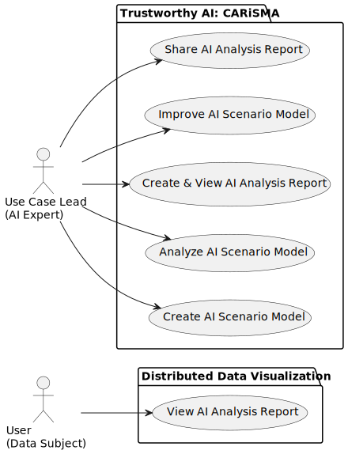
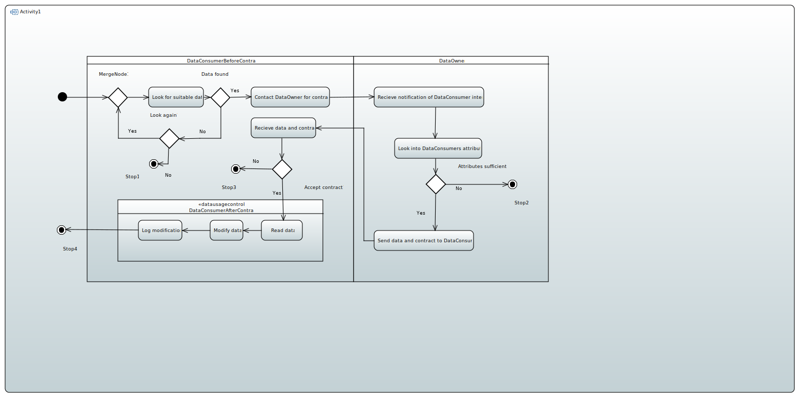
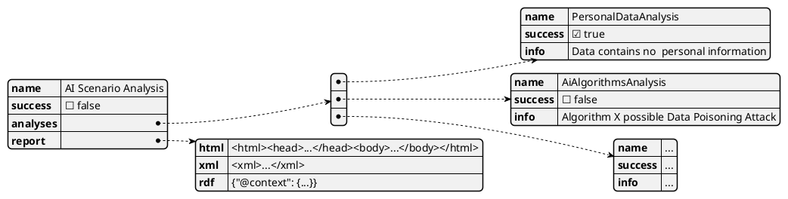
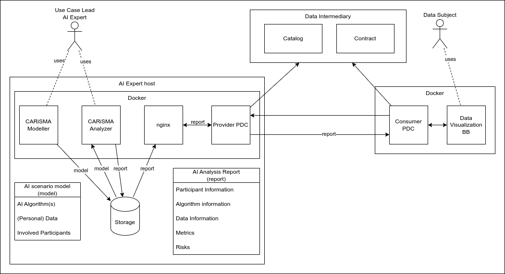
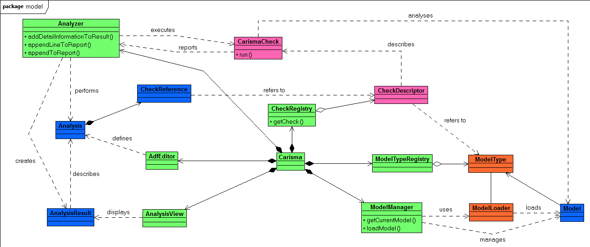

# Trustworthy AI: Algorithm Assessment Design Document for CARiSMA (UoK)

## Summary

The LORIA and Affectlog solutions are complemented by [CARiSMA (CompliAnce, Risk, and Security ModelAnalyzer)](https://github.com/CARiSMA-Tool/carisma-tool), developed by the University of Koblenz and Fraunhofer ISST. CARiSMA is a comprehensive open source software suite that enables system designers and security experts to perform automated compliance analyses, risk analyses and security analyses of software and system models. This allows users to consider security requirements early in the development process. Unified Modelling Language (UML) models are annotated with security-specific requirements that can be tailored to the users’ needs to cover a wide range of topics. Checks are performed on UML models, analyzing the models against the specified requirements and providing the user with detailed feedback on the models' compliance with the previously defined requirements.

In the context of Trustworthy AI assessment, it is planned to extend the approach to generate informative documentation that helps users to understand, how their personal data is processed within an AI Scenario. This is achieved by defining a UML extension that an Use Case Lead (AI Expert) uses whithin the *CARiSMA Modeler* to create an *AI Scenario Model*, which is a UML model containing additional AI specific information. The AI scenario models can be analyzed and assessed by the *CARiSMA Analyzer* regarding [AI/ML specific security issues](https://owasp.org/www-project-machine-learning-security-top-10/) as identified by the Open Worldwide Application Security Project (OWASP) community. These analyses  yield an *AI Analysis Report*, which, on the  one hand, helps the Use Case Lead to improve the scenario. On the other hand, the AI Analysis Report can then be shared with the visualization building block to present the report to the natural persons, whose personal data is processed within the AI scenario. This improves the understandability of the AI scenario and contributes to fulfill documentation obligations as defined in [EU’s AI Act](https://www.europarl.europa.eu/topics/en/article/20230601STO93804/eu-ai-act-first-regulation-on-artificial-intelligence).

## Technical usage scenarios & Features

**Key functionalities:**

- Ability to model Trustworthy AI systems
- Get feedback about trust factors of AI system
- Automatically generating reports of system for documentation purposes
- Visualize Trustworthiness of AI systems

**Value-added:**

- Increasing user's trust in AI system
- System engineer gets a better understanding of risk in system modeling 
- System engineer gets automated feedback about his system

### Features/main functionalities

- **Modelling Trustworthy AI systems:** CARiSMA utilizes the profile mechanism of the Unified Modeling Language (UML) which allows to tailor the UML to different, more specific scenarios. 
  - Use Case Lead (AI Expert) models his system with the Papyrus Modeling Tool
  - Use Case Lead applies the profile delivered with CARiSMA to his model
  - Use Case Lead applies stereotypes of the profile to  selected elements of his system model
  - Use Case Lead fills the tagged values associated with the stereotypes
  - Use Case Lead applies constraints to model elements
  - Alternatively : The profile mechanism of the CARiSMA tool allows the user to define new stereotypes, tags and constraints for UML elements of his choice
- **Feedback about trust factors of AI system:** CARiSMA utilizes an Analyzer which implements a series of different analyses for different types of structure and behavioral diagrams/models. 
  - Use Case Lead (AI Expert) has finished the creation of his system with the new profile
  - Use Case Lead creates a new CARiSMA analysis file 
  - Use Case Lead chooses the .uml file of his system/model as an input for the analysis 
  - Use Case Lead chooses one (or more) of a list of predefined checks/analysis
  - Use Case Lead runs the selected checks/analyses
  - A positive/negative feedback is shown on the screen
  - Alternatively : The plugin architecture of CARiSMA allows the user to implement new new checks/analyses making use of (newly created) stereotypes defined in the profile
- **Reports of system for documentation purposes:** CARiSMA enables the automatic generation of reports which contain information on the trustworthiness of a system.
  - Use Case Lead (AI Expert) has finished the creation of his system with the new profile
  - Use Case Lead ran a number of checks/analysis
  - Use Case Lead clicks on the displayed (positive/negative) analysis result/feedback 
  - Use Case Lead chooses to generate a report
  - Use Case Lead decides on the XML format and clicks on generate report
  - A XML report file is created in the project of the Use Case Leads modeled system
  - Use Case Lead opens the XML reports and gets further information of security risks that occurred during the modeling process
  - Use Case Lead has the opportunity to refine his system depending on the information received in the report 
  - Alternatively : Use Case Lead creates a HTML report instead of a XML report 
- **Trustworthiness visualization of AI systems:** CARiSMA will have functions for JSON creation of reports as well as communication of these reports between data space connectors. Visualization components are therefore enabled to visualize these reports on a user's personal dashboard.
  - Use Case Lead (AI Expert) has finished the creation of his system with the new profile
  - Use Case Lead ran a number of checks/analysis
  - Use Case Lead clicks on the created report
  - Use Case Lead clicks on send
  - The report gets send to the visualization BB 

### Technical usage scenarios

CARiSMA is beneficial for AI system engineers:

- **Trust Enhancement:** Helps to increase the user trust in AI systems by providing a structured method to evaluate and visualize the AI system's trustworthiness.
- **Risk Understanding:** Assists system engineers in better understanding and managing risks associated with AI system modeling.
- **Fast Feedback:** Offers immediate feedback on AI systems and therefore helps to identify issues early in the development process.
- **Documentation:** Automates the documentation process with comprehensive reports ad therefore saves time and ensuring consistent documentation, e.g. as required by the EU AI Act.
- **Customization:** Allows for tailored modeling and analysis to fit specific scenarios and requirements through customizable profiles and analysis checks.

## Requirements

### Use Cases

| Use Case              | Create AI Scenario Model                                                           |
|-----------------------|------------------------------------------------------------------------------------|
| Actor(s)              | Use Case Lead (AI Expert)                                                                         |
| Brief Description     | Use Case Lead creates a system model in context of Trustworthy AI                      |
| Pre-Conditions        | Eclipse, Papyrus and CARiSMA installed                                             |
| Post-Conditions       | A model of a system with stereotypes, tags and constraints                         |
| Main Success Scenario | Use Case Lead designed a system, annotates the required stereotypes, tags, constraints |

| Use Case              | Analyze AI Scenario Model                                                                                 |
|-----------------------|-----------------------------------------------------------------------------------------------------------|
| Actor(s)              | Use Case Lead (AI Expert)                                                                                 |
| Brief Description     | Use Case Lead analyzes a system model in context of Trustworthy AI                                        |
| Pre-Conditions        | A system model in context of Trustworthy AI has been created                                              |
| Post-Conditions       | A feedback is given to the Use Case Lead whether his system is correct or not                             |
| Main Success Scenario | Use Case Lead creates a CARiSMA analysis file, chooses the analysis type he wants to execute and clicks "Run"|

| Use Case              | Create & View AI Analysis Report                                                                                                                                                       |
|-----------------------|----------------------------------------------------------------------------------------------------------------------------------------------------------------------------------------|
| Actor(s)              | Use Case Lead (AI Expert)                          |
| Brief Description     | Use Case Lead creates an analysis report of a model in context of Trustworthy AI                                                                                                           |
| Pre-Conditions        | A system has been modeled and an analysis file is created and executed                                                                                                                 |
| Post-Conditions       | An HTML or XML file which contains information on the success or failure of the analysis including a brief description of possible mistakes                                            |
| Main Success Scenario | Use Case Lead clicks on the result of the analysis and chooses the format he want to create the report in, a file gets created in the folder of the model, the Use Case Leads opens the report |

| Use Case              | Improve AI Scenario Model                                                                                                                                                                                                                                                                      |
|-----------------------|------------------------------------------------------------------------------------------------------------------------------------------------------------------------------------------------------------------------------------------------------------------------------------------------|
| Actor(s)              | Use Case Lead (AI Expert)                                                                                                                                                                                                                                                                                      |
| Brief Description     | Use Case Lead uses the error pointed out in the AI Analysis Report to improve them in the modeled system                                                                                                                                                                                           |
| Pre-Conditions        | A system has been modeled and an analysis report file is created which contains errors for the Checks/Analysis executed                                                                                                                                                                        |
| Post-Conditions       | An improved system model which contains no more errors after the same Analysis is executed again                                                                                                                                                                                               |
| Main Success Scenario | Use Case Lead opens the report which shows him one (or several more) errors, he improves his system regarding the errors and saves the system model, he opens the analysis file again and runs the analysis again, he creates another report which shows him a success for all the checks executed |

| Use Case              | Share AI Analysis Report                                                                                                                                                    |
|-----------------------|-----------------------------------------------------------------------------------------------------------------------------------------------------------------------------|
| Actor(s)              | Use Case Lead (AI Expert)                                                                                                                                                                    |
| Brief Description     | Use Case Lead clicks on the analysis of the system and chooses send, he specifies the address and clicks send                                                                   |
| Pre-Conditions        | A system has been modeled and an analysis file is created and executed                                                                                                      |
| Post-Conditions       | A JSON file is created and send to a Connector specialized by the Visualization BB                                                                                          |
| Main Success Scenario | Use Case Lead clicks on the result of the analysis and chooses "send", (specifies the location of the Visualization BB) and the analysis JSON gets send to the Visualization BB |

### Requirements

- R1. CARiSMA MUST allow an Use Case Lead (AI Expert) to create an AI scenario model
- R2. CARiSMA MUST allow an Use Case Lead (AI Expert) to analyse the AI scenario model
- R3. CARiSMA MUST allow an Use Case Lead (AI Expert) to create an AI Analysis report
- R4. CARiSMA MUST allow an Use Case Lead (AI Expert) to view the AI Analysis Report
- R5. CARiSMA MUST allow an Use Case Lead (AI Expert) to improve the AI Analysis Report
- R6. CARiSMA SHOULD allow an Use Case Lead (AI Expert) to share an AI Analysis Report in a predefined format that can be visualized in the building block "Distributed Data Visualization"

## Integrations

### Direct Integrations with Other BBs

Analysis results can be stored in a JSON/HTML file format and sent to the building block "Decentralized Data Visualization" that visualizes the check result (maybe in a checkbox green/red). Also further details could be sent with the report (e.g. information when hovering over this checkbox). Data format could be a json-ld document using some standardized vocabulary/ontology.

### Integrations via Connector

It's planned to use a PDC to share AI Analysis Reports with the building block "distributed data visualiation".

## Relevant Standards

### Data Format Standards

CARiSMA in the context of this building block makes use of the following standards, data formats and markup languages:

- UML (XMI serialization)
- HTML (for reports)
- XML (for reports)
- JSON-LD / RDF (for reports)

### Mapping to Data Space Reference Architecture Models

CARiSMA in the context of this building block does not implement an element of a data space reference architecture model. It does make use of a connector implementation (the PDC) as defined by the Reference Architecture Model of the International Data Spaces Association (IDS-RAM).

## Input / Output Data

### Input

No data from other building blocks will be received. Papyrus allows the creation of Unified Modeling Language (UML) models in the .di format via a graphical user interface. When such a model is created, a corresponding .uml file is created at the same time, which represents and saves this model in a tree structure used as an input for the CARiSMA tool. An extension will allow the user to model his system in the context of “Trustworthy AI”, for example by creating an AI scenario model on the use of data with personal information, by annotating various model elements with new stereotypes, tagged values and constraints.

For each of these .uml files, a CARiSMA analysis file can be created which allows to select various checks/analyses via an UI tailored to the problem the user wants to analyze his system design. In the context of our previous example for a “Trustworthy AI” scenario, the user will be able to select an analysis that checks whether personal data has been made unrecognizable or not.

### Output

Once an analysis is complete, the Use Case Lead (AI Expert) is informed of its outcome, indicating whether it is positive or negative. Additionally, the Use Case Lead has the option to generate a report in different machine-readable formats, providing further details on potential issues and sources of risks in system modeling. This enables the Use Case Lead to make necessary adjustments and refinements to the system, thereby closing security and risk gaps and establishing trust within the system.

Once the model of the system design is finalized, the Use Case Lead (AI Expert) can trigger the sharing of the AI Analysis Report with other components. It's planned to share the AI Analysis Report with the building block "Decentralized Data Visualization". The user (data subject) is then able to view the report to get insights of how their data is processed within an AI scenario. The format of the shared AI Analysis Report looks as follows (subject to change):

## Architecture

The integration of CARiSMA into the data space is illustrated in Figure 6. The created data are an *AI scenario model* and an *AI Analysis report*. The analysis report can be shared with other building blocks via a data space connector (PDC). This allows a data subject to retrieve and read the report in order to be informed about potential risks in the AI scenario the user considers to use.

### CARiSMA's Internal Structure

The main class Carisma is registered as an Eclipse plugin and provides access to the various structures, serving as the controller for the different components of the tool.

An Analysis is executed on a Model of a certain `ModelType` registered within the `ModelTypeRegistry`. The models themselves are provided by the `ModelManager` and the `ModelLoader` for the corresponding `ModelType`.

CARiSMA executes analyses consisting of various `CheckReferences` to `CheckDescriptors`. These descriptors define the `CarismaCheck`s that have been registered with the `CheckRegistry`. Each `CarismaCheck` may have any number of `CheckParameters` defined, which has a certain `ParameterType`. Checks may define pre- and post-conditions to use in combination with a blackboard to exchange information between them.

The `AnalysisHost` interface provides access to this blackboard, as well as methods for displaying the results of an Analysis in the `AnalysisResultsView`. The Analyzer is the main CARiSMA implementation of the `AnalysisHost` interface.

## Dynamic Behaviour

The sequence diagram shows how the component communicates with other components.

## Configuration and deployment settings

- CARiSMA is configured in the graphical user interface
- Configuration of the Prometheus-X Data Space Connector (PDC), used to share AI Analysis Reports with the visualization building block, is documented by the PDC building block

## Third Party Components & Licenses

CARiSMA is licensed under the [Eclipse Public License v1.0](https://www.eclipse.org/legal/epl-v10.html). CARiSMA is based on the [Eclipse IDE](https://www.eclipse.org/) and on [Papyrus](https://eclipse.dev/papyrus/). To run CARiSMA Eclipse IDE and Papyrus need to be installed. Both products are licensed under [Eclipse Public License v2.0](https://www.eclipse.org/legal/epl-2.0/).

Additional third party libraries are required by / shipped with CARiSMA:

[Apache License, Version 2.0](https://www.apache.org/licenses/LICENSE-2.0)
  - [Apache Commons Lang3](https://mvnrepository.com/artifact/org.apache.commons/commons-lang3), [Apache Commons IO](https://mvnrepository.com/artifact/commons-io/commons-io), [Apache Commons Text](https://mvnrepository.com/artifact/org.apache.commons/commons-text), [Apache Felix Maven SCR Plugin Use](https://felix.apache.org/documentation/subprojects/apache-felix-maven-scr-plugin/apache-felix-maven-scr-plugin-use.html), [Jakarta Dependency Injection](https://mvnrepository.com/artifact/jakarta.inject/jakarta.inject-api), [OSGi Service Prefs](https://mvnrepository.com/artifact/org.osgi/org.osgi.service.prefs), [OSGi Namespace Extender](https://mvnrepository.com/artifact/org.osgi/org.osgi.namespace.extender), [OSGi Service Event](https://mvnrepository.com/artifact/org.osgi/org.osgi.service.event), [OSGi Namespace Implementation](https://mvnrepository.com/artifact/org.osgi/org.osgi.namespace.implementation), [OSGi Annotation](https://mvnrepository.com/artifact/org.osgi/org.osgi.annotation), [OSGi Utilities Function](https://mvnrepository.com/artifact/org.osgi/org.osgi.util.function), [OSGi Service Component](https://mvnrepository.com/artifact/org.osgi/org.osgi.service.component/1.3.0), [OSGi Utilities Promise](https://mvnrepository.com/artifact/org.osgi/org.osgi.util.promise), [Java Native Access Platform](https://mvnrepository.com/artifact/net.java.dev.jna/jna-platform)

[EDL 1.0](https://www.eclipse.org/org/documents/edl-v10.php)
  - [Jakarta XML Binding API](https://mvnrepository.com/artifact/jakarta.xml.bind/jakarta.xml.bind-api), [Jakarta Activation API](https://mvnrepository.com/artifact/jakarta.activation/jakarta.activation-api), [JAXB Runtime](https://mvnrepository.com/artifact/org.glassfish.jaxb/jaxb-runtime), [JAXB Core](https://mvnrepository.com/artifact/org.glassfish.jaxb/jaxb-core), [TXW2](https://mvnrepository.com/artifact/org.glassfish.jaxb/txw2), [Istack Common Utility Code Runtime](https://mvnrepository.com/artifact/com.sun.istack/istack-commons-runtime), [Angus Activation Registries](https://mvnrepository.com/artifact/org.eclipse.angus/angus-activation/1.0.0)

[BOUNCY CASTLE LICENSE](https://www.bouncycastle.org/licence.html)
  - [Bouncy Castle ASN.1 Extension and Utility APIs](https://mvnrepository.com/artifact/org.bouncycastle/bcutil-jdk18on), [Bouncy Castle Provider](https://mvnrepository.com/artifact/org.bouncycastle/bcprov-jdk18on), [Bouncy Castle OpenPGP API](https://mvnrepository.com/artifact/org.bouncycastle/bcpg-jdk18on)

[GNU Lesser General Public License, version 2.1](https://www.gnu.org/licenses/old-licenses/lgpl-2.1.en.html)
  - [Java Native Access](https://mvnrepository.com/artifact/net.java.dev.jna/jna), [Java Native Access Platform](https://mvnrepository.com/artifact/net.java.dev.jna/jna-platform)  

[EPL 2.0](https://www.eclipse.org/legal/epl-2.0/), [GPL](https://www.gnu.org/licenses/gpl-3.0.en.html)
  - [Jakarta Annotations API](https://mvnrepository.com/artifact/jakarta.annotation/jakarta.annotation-api)

[BSD 3-clause](https://x-stream.github.io/license.html)
  - [xstream](https://x-stream.github.io/)

[mXparser - LICENSE](https://mathparser.org/mxparser-license/)  
  - [mxparser](https://mathparser.org/)

[MIT license](https://www.mojohaus.org/animal-sniffer/licenses.html)
  - [Animal Sniffer Annotations](https://mvnrepository.com/artifact/org.codehaus.mojo/animal-sniffer-annotations)

[ICU4J license](https://docs.oracle.com/cloud/latest/big-data-discovery-cloud/BDDLG/cl_icu4j_license.htm#BDDLG-concept_AB4527297161480DD261AC24135650FE)
  - [ICU4J](https://mvnrepository.com/artifact/com.ibm.icu/icu4j)

Public
- [XZ](https://mvnrepository.com/artifact/org.tukaani/xz/1.9), [XML Pull Parsing API](https://mvnrepository.com/artifact/xmlpull/xmlpull)

<!--- Commented out in case of preferring this version 
- [Apache Commons Lang3](https://mvnrepository.com/artifact/org.apache.commons/commons-lang3): [Apache License, Version 2.0](https://www.apache.org/licenses/LICENSE-2.0)
- [Apache Commons IO](https://mvnrepository.com/artifact/commons-io/commons-io): [Apache License, Version 2.0](https://www.apache.org/licenses/LICENSE-2.0)
- [Apache Commons Text](https://mvnrepository.com/artifact/org.apache.commons/commons-text): [Apache License, Version 2.0](https://www.apache.org/licenses/LICENSE-2.0)
- [Apache Felix Maven SCR Plugin Use](https://felix.apache.org/documentation/subprojects/apache-felix-maven-scr-plugin/apache-felix-maven-scr-plugin-use.html): [Apache License, Version 2.0](https://www.apache.org/licenses/LICENSE-2.0)
- [Jakarta XML Binding API](https://mvnrepository.com/artifact/jakarta.xml.bind/jakarta.xml.bind-api): [EDL 1.0](https://www.eclipse.org/org/documents/edl-v10.php)
- [Jakarta Dependency Injection](https://mvnrepository.com/artifact/jakarta.inject/jakarta.inject-api): [Apache License, Version 2.0](https://www.apache.org/licenses/LICENSE-2.0)
- [Jakarta Activation API](https://mvnrepository.com/artifact/jakarta.activation/jakarta.activation-api): [EDL 1.0](https://www.eclipse.org/org/documents/edl-v10.php)
- [Jakarta Annotations API](https://mvnrepository.com/artifact/jakarta.annotation/jakarta.annotation-api): [EPL 2.0](https://www.eclipse.org/legal/epl-2.0/), [GPL](https://www.gnu.org/licenses/gpl-3.0.en.html)
- [JAXB Runtime](https://mvnrepository.com/artifact/org.glassfish.jaxb/jaxb-runtime): [EDL 1.0](https://www.eclipse.org/org/documents/edl-v10.php)
- [JAXB Core](https://mvnrepository.com/artifact/org.glassfish.jaxb/jaxb-core): [EDL 1.0](https://www.eclipse.org/org/documents/edl-v10.php)
- [OSGi Service Prefs](https://mvnrepository.com/artifact/org.osgi/org.osgi.service.prefs): [Apache License, Version 2.0](https://www.apache.org/licenses/LICENSE-2.0)
- [OSGi Namespace Extender](https://mvnrepository.com/artifact/org.osgi/org.osgi.namespace.extender): [Apache License, Version 2.0](https://www.apache.org/licenses/LICENSE-2.0)
- [OSGi Service Event](https://mvnrepository.com/artifact/org.osgi/org.osgi.service.event): [Apache License, Version 2.0](https://www.apache.org/licenses/LICENSE-2.0)
- [OSGi Namespace Implementation](https://mvnrepository.com/artifact/org.osgi/org.osgi.namespace.implementation): [Apache License, Version 2.0](https://www.apache.org/licenses/LICENSE-2.0)
- [OSGi Annotation](https://mvnrepository.com/artifact/org.osgi/org.osgi.annotation): [Apache License, Version 2.0](https://www.apache.org/licenses/LICENSE-2.0)
- [OSGi Utilities Function](https://mvnrepository.com/artifact/org.osgi/org.osgi.util.function): [Apache License, Version 2.0](https://www.apache.org/licenses/LICENSE-2.0)
- [OSGi Service Component](https://mvnrepository.com/artifact/org.osgi/org.osgi.service.component/1.3.0): [Apache License, Version 2.0](https://www.apache.org/licenses/LICENSE-2.0)
- [OSGi Utilities Promise](https://mvnrepository.com/artifact/org.osgi/org.osgi.util.promise): [Apache License, Version 2.0](https://www.apache.org/licenses/LICENSE-2.0)
- [Bouncy Castle ASN.1 Extension and Utility APIs](https://mvnrepository.com/artifact/org.bouncycastle/bcutil-jdk18on): [BOUNCY CASTLE LICENSE](https://www.bouncycastle.org/licence.html)
- [Bouncy Castle Provider](https://mvnrepository.com/artifact/org.bouncycastle/bcprov-jdk18on): [BOUNCY CASTLE LICENSE](https://www.bouncycastle.org/licence.html)
- [Bouncy Castle OpenPGP API](https://mvnrepository.com/artifact/org.bouncycastle/bcpg-jdk18on): [Apache License, Version 2.0](https://www.apache.org/licenses/LICENSE-2.0), [BOUNCY CASTLE LICENSE](https://www.bouncycastle.org/licence.html)
- [Java Native Access](https://mvnrepository.com/artifact/net.java.dev.jna/jna): [Apache License, Version 2.0](https://www.apache.org/licenses/LICENSE-2.0), [GNU Lesser General Public License, version 2.1](https://www.gnu.org/licenses/old-licenses/lgpl-2.1.en.html)
- [Java Native Access Platform](https://mvnrepository.com/artifact/net.java.dev.jna/jna-platform): [Apache License, Version 2.0](https://www.apache.org/licenses/LICENSE-2.0), [GNU Lesser General Public License, version 2.1](https://www.gnu.org/licenses/old-licenses/lgpl-2.1.en.html)
- [xstream](https://x-stream.github.io/): [BSD 3-clause](https://x-stream.github.io/license.html)
- [mxparser](https://mathparser.org/): [mXparser - LICENSE](https://mathparser.org/mxparser-license/)
- [TXW2](https://mvnrepository.com/artifact/org.glassfish.jaxb/txw2): [EDL 1.0](https://www.eclipse.org/org/documents/edl-v10.php)
- [Istack Common Utility Code Runtime](https://mvnrepository.com/artifact/com.sun.istack/istack-commons-runtime): [EDL 1.0](https://www.eclipse.org/org/documents/edl-v10.php)
- [Angus Activation Registries](https://mvnrepository.com/artifact/org.eclipse.angus/angus-activation/1.0.0): [EDL 1.0](https://www.eclipse.org/org/documents/edl-v10.php)
- [Animal Sniffer Annotations](https://mvnrepository.com/artifact/org.codehaus.mojo/animal-sniffer-annotations): [MIT license](https://www.mojohaus.org/animal-sniffer/licenses.html)
- [XZ](https://mvnrepository.com/artifact/org.tukaani/xz/1.9): Public
- [ICU4J](https://mvnrepository.com/artifact/com.ibm.icu/icu4j): [ICU4J license](https://docs.oracle.com/cloud/latest/big-data-discovery-cloud/BDDLG/cl_icu4j_license.htm#BDDLG-concept_AB4527297161480DD261AC24135650FE)
- [XML Pull Parsing API](https://mvnrepository.com/artifact/xmlpull/xmlpull): Public
--->
## OpenAPI Specification

The component does not provide an API, since it does not receive data from other components / building blocks. All data is created manually within CARiSMA.

## Test specification

### Test plan

The testing strategy will include JUnit based tests of the implementation of CARiSMA (automated CI/CD pipeline via GitHub) and integration tests, covering the communication of different connectors via e.g. Postman and/or additional automated tests, therefore employing a combination of automated and manual testing methods to ensure comprehensive coverage.

### Unit tests

Unit tests will be implemented for three newly developed components. Each test case will verify specific functionalities:

##### Component Profile

An extension of the Unified Modeling Language (UML) which allows for Trustworthy AI specific annotations to a model.

Test cases :
* Verify that all neccessary element, like actions, associations and classes can be annotated with the required stereotypes.
* Ensure that unsupported elements cannot be annotated with any stereotypes defined for Trustworthy AI specific annotations
* Confirm that double annotated elements with the same stereotype are not possible
* Verify that conflicting stereotype annotations are handled properly

##### Component Check/Analysis

A component which analyses a given model and gives a feedback whether the model is correct

Test cases :
* Verify that an analysis file can be created
* Confirm that all Trustworthy AI specific Checks can be choosen in the CARiSMA analysis file
* Test that errors in an incorrect model are identified in the analysis file 
* Confirm that a previously incorrect model can be modified after an analysis was conducted
* Ensure that an altered model can be analyzed again with the newly altered content
* Verify that a correct model passes an analysis

##### Component HTML/XML/JSON-LD Report

A component which enables the creation for HTML/XML/JSON-LD reports for a given analysis of a model/system

Test cases :
* Verify the successful creation of a HTML report containing the accurate content for either a valid or invalid analysis
* Verify the successful creation of a XML report containing the accurate content for either a valid or invalid analysis
* Confirm JSON-LD reports include all required metadata and adhere to the expected structure

### Integration tests

* Verify that all API endpoints respond correctly to valid requests 
* Test behavior for invalid requests, for example with unauthorized access
* Confirm that endpoints maintain expected performance under high load conditions
* Validate the correct communication between neccessary endpoints

### UI test (where relevant)

CARiSMA's graphical user interface is based on the Eclipse IDE and Papyrus, a Eclipse based graphical UML modeling tool. Eclipse's and Papyrus's user interfaces are tested during Eclipse's or Papyrus's development, respectively. Additional UI tests of CARiSMA specific extensions are performed manually. Regularly tested are:

- Analysis definition file (ADF) editor
- Initiation of analysis report cration (export of HTML / XML report)
- CARiSMA perspective (window configuration)

## Partners & roles

This component of the building block "Trustworthy AI: Algorithm assessment" is developed by University of Koblenz and the associated partner Fraunhofer ISST. It complements the AI algorithm assessment approaches of LORIA and Affectlog. For the integration with the building block "distributed data visualization", cooperation with HeadAI, Institut Mines Telecom and Visions may become necessary.

## Usage in the dataspace

While the other components of this building block and other building blocks are generally used during run time, this component of the building block "Trustworthy AI: Algorithm assessment" is used during design time. It creates useful information about the scenarios that involve AI algorithms to process personal data.
