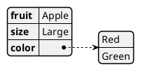
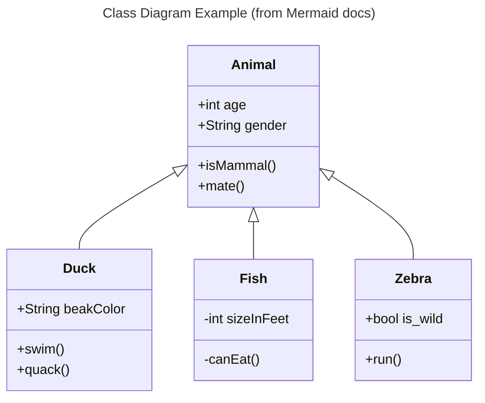
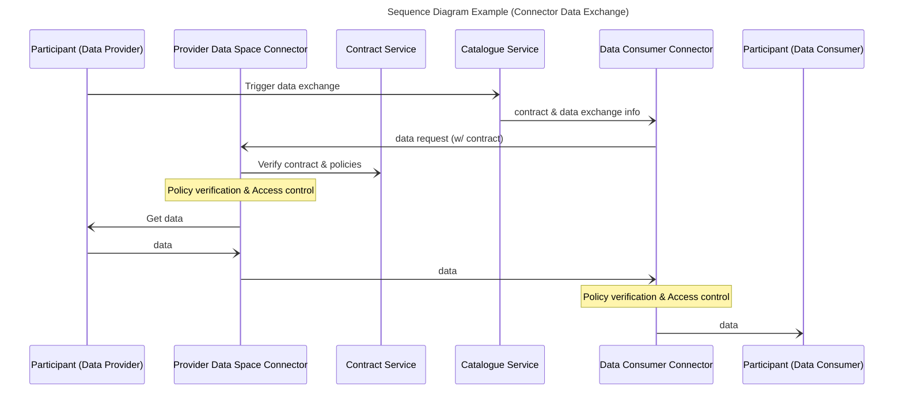
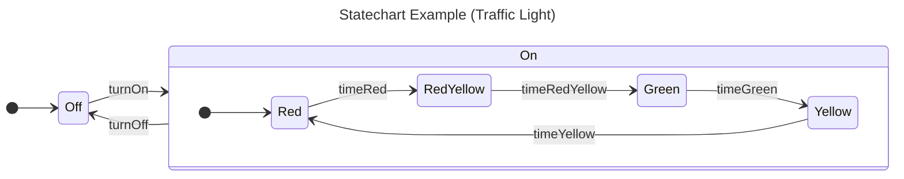

# UoK's Trustworthy AI Design Document

_This is just a template.
Replace italic text with your own content.
Replace the title with `<BB name> Design Document`.
Using [Mermaid](http://mermaid.js.org/intro/) and/or [PlantUML](https://plantuml.com/) diagrams are recommended; see examples below.
You should also remove this paragraph._

## Summary
_Summary of the BB in 1-2 concise paragraphs.
What does it do?
What are the main components?_


## Technical usage scenarios & Features


_Brief summary of use cases and features.
See "BB info for use cases (WP2)" spreadsheet._

### Features/main functionalities

_In-depth description of BB features (details).
Again, an enumeration (ie bullet points) is useful. Take input from description for WP2_

### Technical usage scenarios

_In-depth description of the use cases of the BB.
Explain why would one want to use this BB.
What services, features does it offer, why these are useful.
A bullet point list is recommended._

## Requirements

_High-level BB requirements with identifiers.
eg * **R1.** BB MUST communicate with [other BB]_

_See also the Requirements spreadsheets
Functional requirements should be extended with extra-functional ones:
Timeliness (expected response time@request size), Througput (number of requess served by the BB),etc.
These may be defined later with UCs but have to be indentified here and be part of configuration/deplomyent options_


## Integrations

_See "01_BB Connections" spreadsheet_

### Direct Integrations with Other BBs

_What other BBs does this BB interact with directly (without the connector)?
How?
Why?_

### Integrations via Connector

_What other BBs does this BB integrate with intermediated by the connector?
Why?_

## Relevant Standards

### Data Format Standards

_Any data type / data format standards the BB adheres to_

### Mapping to Data Space Reference Architecture Models

_Mapping to [DSSC](https://dssc.eu/space/DDP/117211137/DSSC+Delivery+Plan+-+Summary+of+assets+publication) or [IDS RAM](https://docs.internationaldataspaces.org/ids-knowledgebase/v/ids-ram-4/)_


## Input / Output Data

_What data does this BB receive?
What data does this BB produce?
If possible, elaborate on the details (data format, contents, etc) and also add potential data requirements._

_Mermaid has no such feature, but you may use PlantUML to automatically visualize JSON schemata; for example:_



_Creating the diagram via the PlantUML JAR:_

```shell-session
$ java -jar plantuml.jar -tsvg json.puml
```

_Gives:_


_Please add a short description, also estimating the workload for a typical transaction of your BB (e.g. "100.000 record/submission", "traces of n*10.000s of events", etc.)._

## Architecture

_What components make up this BB?
If applicable, insert a simple figure, eg a UML class diagram.
What is the purpose of the components and what are their relationships?_

_An example class diagram using Mermaid:_



## Dynamic Behaviour

_What is the behaviour of the BB, how does it operate?
UML sequence diagrams and/or statecharts are recommended._

_Example sequence diagram using Mermaid:_

The sequence diagram shows how the component communicates with other components.



_Example of a statechart using Mermaid:_

This statechart shows the internal state changes of the component.



## Configuration and deployment settings

_What configuration options does this BB have?
What is the configuration format?
Provide examples.
How is the component logging the operations? What are the error scenarios? What are the limits in terms of usage (e.g. number of requests, size of dataset, etc.)?_


## Third Party Components & Licenses

_Does this BB rely on any 3rd-party components?
See also the "EDGE third party/background components" spreadsheet.


## Implementation Details

_This is optional: remove this heading if not needed.
You can add details about implementation plans and lower-level design here._

## OpenAPI Specification

_In the future: link your OpenAPI spec here._

## Test specification

_Test definitions and testing environment should be availaible, and the tests should be repeatable._

### Test plan
Testing strategy, tools and methods chosen, methods for acceptance criteria.
To be detailed.

### Unit tests

_Here specify the test cases for the components inside the BB.  
Candidates for tools that can be used to implement the test cases: JUnit, Mockito, Pytest._

### Integration tests

_Here specify how to test the integration of the components inside the BB.  
Candidates for tools that can be used to implement the test cases: K6, Postman, stepci, Pact  
An example tutorial is available [here](https://github.com/ftsrg-edu/swsv-labs/wiki/2b-Integration-testing)._

### UI test (where relevant)

_Candidates for tools that can be used to implement the test cases: Selenium_

## Partners & roles

## Usage in the dataspace
