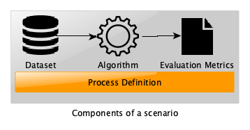
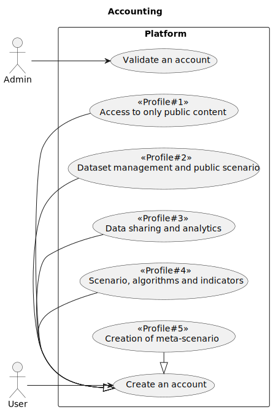
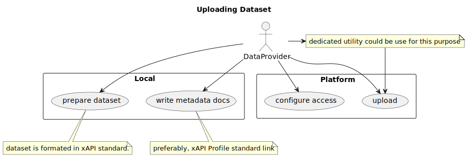
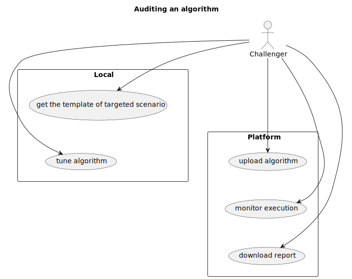
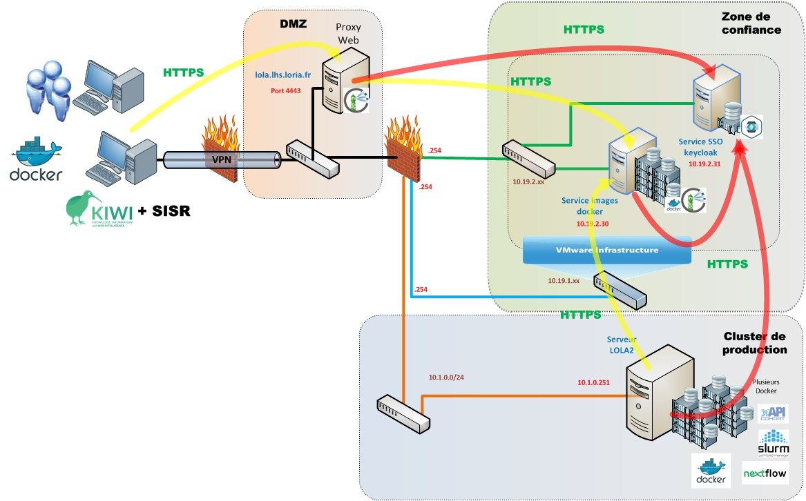

# LORIA's Trustworthy AI (LOLA) Design Document

LOLA is an autonomous platform intended to audit AI algorithms as closely as possible to their use by relying on datasets shared by the EdTech community and more specifically, publishers of digital educational resources and learning online services providers.

The platform hosts a set of **scenarios** which each represents a use case around a combination of datasets, AI algorithms and quality metrics specific to each scenario.

It is thus possible to experiment an algorithm in the context of a diversity of datasets.
And conversely, it is also possible to benchmark several algorithms on the same dataset.

The main challenges of LOLA are:

- **Transparency**: this is the first important element of trustworthiness. It results in the standardization of scenarios which allow the benchmarking of candidate algorithms according to the same functional performance evaluation processes. In addition, the result, in the form of a report, constitutes a shareable audit.
- **Security**: this is the second element of trustworthiness. On the one hand, the datasets are stored in a high security private data center and on the other hand, the system does not allow algorithm experimenters to copy the data entrusted by the providers.
- **Innovation**: the permanent opening of the platform allows continuous improvement by feeding it with new datasets and new algorithms according to progress in research and development knowledge

## Technical usage scenarios & Features

### Features/main functionalities
As stated previously, LOLA provides space to host scenarios.
A scenario constitutes a contribution from an organization and corresponds to a task linked to a learning analytics issue which needs using an AI algorithm.
Let us cite here some (non-exhaustive) examples of issues: prediction of dropouts, detection of students at risk, recommendations for educational resources, etc.

Each scenario is constructed according to the model represented schematically as follows:

Consequently, we distinguish three types of use of the platform:

1. Design of a new scenario: this activity requires 

- to define the scenario execution process,
- to propose a baseline algorithm 
- and to design a set of metrics for evaluating the functional features of the algorithm.

2. Audit of a new algorithm: this requires

- to locally experiment (and eventually to tune) the algorithm in a sandbox framework including  a processing chain provided by the platform where data are replaced by artificial dataset,
- to plug the algorithm into the platform via a private Docker Harbor,
- to use the tools provided by the platform to monitor the progress of the process and to retrieve the evaluation report.

3. Sharing of a new dataset: this requires

- to upload a dataset in xAPI format using the secure sFTP protocol or use an utility provided by the platform which simplifies the procedure,
- define the access rights to be assigned to the dataset (private, public or open to a restricted set of members).

### Technical usage scenarios

**Accounting**

Whatever the intended use, it is necessary to first have an account to access the platform's services.

Here is the use case diagram for this step.

Some comments:

- There are 5 type of user profile (or role)
	1.	basic pofile that permit to acces to public contents
	2. for a private use of platform (private dataset and scenario)
	3. for users who wish to open their dataset to third-party algorithms
	4. for users who wish to audit or challenge their algorithms on data linked to one or more scenarios
	5. for scenario designers	
- An account request is subject to administrator approval

**Uploading a dataset**

Here is the use case diagram for the dataset sharing activity.

Some comments:

- Dataset are mainly learning traces generated from learning platform and formated in xAPI standard.
- Metadata could be described on the xAPI profile server [xAPI profile server ](https://profiles.adlnet.gov/profiles) 
- For the upload task, a dedicated utility we developed could be used for a secured tranfer (it uses the sFTP protocol).

**Auditing an algorithm**

Here is the use case diagram for the algorithm auditing activity.

Some comments:

- After identifying the targeted scenario, the algorithm designer (called the *challenger*), upload a template of scenario from the *sandbox* of the platform.
- The template is intended to be installed on a local machine in order to tune the algorithm
- It contains the entire processing chain including the evaluation metrics used.
- The dataset present is synthetic data in order to preserve the confidentiality of real experimental data.
- A baseline algorithm should be substituted by the user's algorithm
- Once the local configuration is stabilized, the algorithm is transferred to the platform via a container on a private Docker repository (*Docker Harbor*)
- From this moment, the user can monitor the execution of his algorithm (startup, interruption, error reporting, etc.)
- At the end, a report consisting of the evaluation metrics is available

**Designing a scenario**

Here is the use case diagram for the scenario designing activity.

Some comments:

- Experimental protocol could be designed as a process model
- The protocol is then implemented in *NextFlow* script(see [https://www.nextflow.io/](https://www.nextflow.io/)).
- The workflow is tested on a (open) baseline algorithm.
- Then the scenario could be uploded to the platform.
- The configuration phase defines the association the scenario to existing datasets.

## Requirements

The LOLA platform is continuously fed by a set of scenarios which each rely on datasets and algorithms which are downloaded asynchronously.
As part of the EDGE Skills project, the main needs concern collaborations with partners who have datasets to integrate into a specific scenario.

At this stage, a charter is planned indicating the commitments of all stakeholders, namely, the LOLA administrator, data providers and algorithm providers.

Another possibility would be to rely on BB#05 (Consent Agent) to formalize the agreements between the actors.

## Integrations

### Direct Integrations with Other BBs

It would be interesting to study the possibility of using BB#05 for contracts management between users (i.e data providers or algorithm designers) and the LOLA administrator.

### Integrations via Connector

The main integration need in the framework of this project concerns the upload of datasets by data providers.
To achieve this task, we require the use of commons standards:

- for the data format, the standard adopted is [IEEE/xAPI](https://opensource.ieee.org/xapi)
- for the metadata format, the format adopted is [JSON-LD](https://json-ld.org/)
- for the metadata sharing, we recommand
[xAPI profile server ](https://profiles.adlnet.gov/profiles)
- for the data tranfer, we used the sFTP protocol

## Relevant Standards

### Data Format Standards

- Data format : [IEEE/xAPI](https://opensource.ieee.org/xapi)

- Metadata format : [JSON-LD](https://json-ld.org/) and displayable/editable on public [xAPI profile server ](https://profiles.adlnet.gov/profiles)

- Data transfert: sFTP protocol
- Algorithm format: Containers technologie (Docker & docker-compose)
- Algorithm transfert and store: Private docker repository
- Scenario format : Data-driven computational pipelines [NextFlow](https://www.nextflow.io/)

##Input / Output Data

As explained above, thera are several type of interactions with the platform, namely Dataset deposit, Algorithm sending, Scenario design and Scenario exécution.

The execution of a scenario is the final objective which allows obtaining an assessment.

We can present in a simplified way that the input to this process is the joint choice of a dataset and an algorithm.

The result is then the evaluation which is presented in the form of indicators and metrics specific to each scenario.
The output format is a JSON file.

##Architecture

The following diagram presents a general view of the secure architecture of the platform.

##Dynamic Behaviour

Here are the sequence diagrams corresponding to the main activities.

###Send Dataset

###Upload Algorithm

###Prepare a scenario

###Execute a scenario

## Configuration and deployment settings

_What configuration options does this BB have?
What is the configuration format?
Provide examples.
How is the component logging the operations? What are the error scenarios? What are the limits in terms of usage (e.g. number of requests, size of dataset, etc.)?_

## Third Party Components & Licenses

| Third Party Component | License | Link |
| --- | --- | --- |
| Nextflow | Apache 2.0 | [https://www.nextflow.io/docs/latest/index.html](https://www.nextflow.io/docs/latest/index.html) |
| TRAX 1.0 | EUPL 1.2 | [https://github.com/trax-project/trax-lrs](https://github.com/trax-project/trax-lrs) |

## Implementation Details

_This is optional: remove this heading if not needed.
You can add details about implementation plans and lower-level design here._

## OpenAPI Specification

_In the future: link your OpenAPI spec here._

## Test specification

_Test definitions and testing environment should be availaible, and the tests should be repeatable._

### Test plan

_Testing strategy, tools and methods chosen, methods for acceptance criteria.
To be detailed._

### Internal unit tests

_Here specify the test cases for the units inside the BB.  
Candidates for tools that can be used to implement the test cases: JUnit, Mockito, Pytest._

### Component-level testing

_Here specify how to test this component/BB as a whole. This is similar to how other BBs will use this component.  
Candidates for tools that can be used to implement the test cases: K6, Postman, stepci, Pact  
An example tutorial is available [here](https://github.com/ftsrg-edu/swsv-labs/wiki/2b-Integration-testing)._

### UI test (where relevant)

_Candidates for tools that can be used to implement the test cases: Selenium_

## Partners & roles

_?_

## Usage in the dataspace
_Specify the Dataspace Enalbing Service Chain in which the BB will be used. This assumes that during development the block (lead) follows the service chain, contributes to tis detailed design and implements the block to meet the integration requirements of the chain._