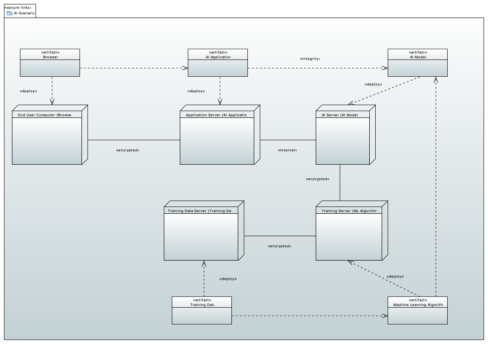
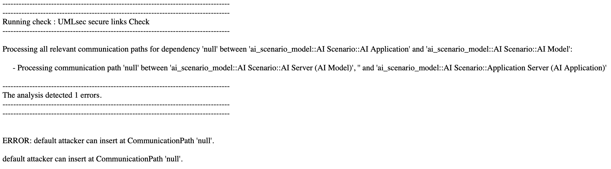

#### Output Integrity Attack
An UMLsec Secure Links Check with associated Stereotypes is applied to the AI Scenario Model, to check wheter a potential attacker has the abilities to commit an "Output Integrity Attack" which looks like the following:
An attacker aims to alter or manipulate the output of a machine learning model to change its behavior or cause harm to the system in which it is used.
One example can be the modification of patient health data.
The attacker has gained access to the output of a machine learning model used to diagnose diseases in a hospital.
Then, the attacker modifies the output of the model so that it generates incorrect diagnoses for patients.
As a result, patients receive incorrect treatments from a doctor, leading to further harm and possibly even death.

In our AI Scenario Model, this kind of attack would be on the Communication Link between the "Application Server (AI Application)" Node and the "AI Server (AI Model)" Node. 
Therefore, we created two Artifacts, one for each of the Nodes, and create a Dependency between those Artifacts. 
This signalizes the CARiSMA-Tool to check wheter integrity is fullfilled when the two Nodes communicate.
Since both Nodes communicate via an LAN connection (indicated by stereotypes), integrity is ensured and a check results in the following output :

Contrary, if both Nodes communicate via a simple internet connection (indicated by the <<Internet>> Stereotype), integrity is not ensured and a check results in the following output :

