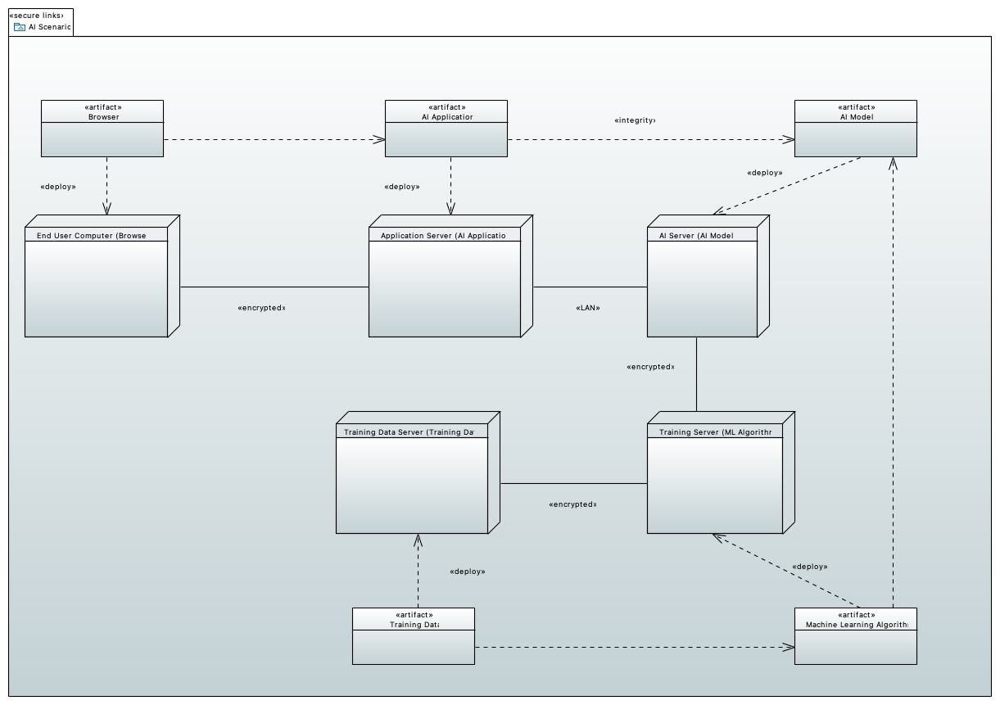
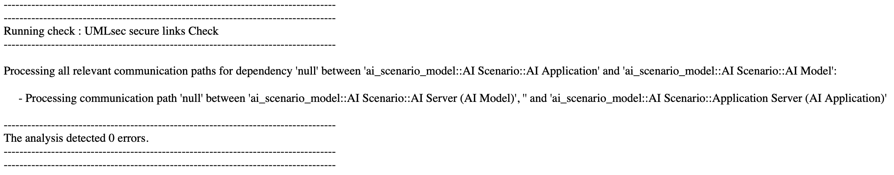
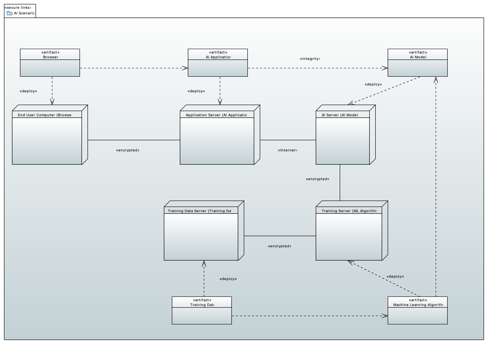
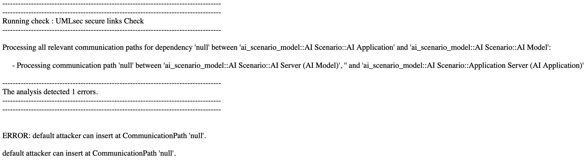

#### Output Integrity Attack
This example illustrates the application of a *UMLsec Secure Links Check* with relevant stereotypes to an AI Scenario Model to check whether a potential attacker has the ability to perform an ["Output Integrity Attack"](https://owasp.org/www-project-machine-learning-security-top-10/docs/ML09_2023-Output_Integrity_Attack.html) as described by OWASP as follows:

"In an Output Integrity Attack scenario, an attacker aims to modify or manipulate the output of a machine learning model in order to change its behavior or cause harm to the system it is used in."

One example of this could involve the alteration of patient health data. Consider an attacker who gains access to the output of a machine learning model used to create medical diagnosis recommendations in a hospital.
If the attacker succeeds in modifying the output of the AI model, it could result in incorrect diagnostic suggestions.
As a result, it may happen that patients receive incorrect treatments from a doctor, leading to further harm and possibly even death.

The example model shows different components of an AI enabled system. Several artifacts (software or data) are deployed on nodes (different machines). In this example we focus on the two artifacts "AI Application" and "AI Model". The "AI Application" depends on the "AI Model" and it is required that messages exchanged by these two artifacts need to preserve integrity (stereotype \<\<integrity\>\>). Both artifacts are deployed on different machines, the "Application Server" and the "AI server", respectively. Between the two nodes, there exists a communication path (consisting of exactly one communication link)
Assume an attacker that tries to perform an output integrity attack as described above. The attacker would try to manipulate a message send via the communication link between the two nodes "Application Server" and "AI Server". If we assume an attacker that is not an insider attacker of the AI provider, they would not be able to manipulate a message send over the communication link, since the model describes the communication link as being an internal connection (\<\<LAN\>\>).
Since there does not exist a path (sequence of connected communication links) between the involved nodes that the (default) attacker is able to write on, a *Secure Links check* will succeed (meaning CARiSMA does not detect a violation of the integrity requirement) and the corresponding CARiSMA check results in the following output :

Contrary, if the two nodes communicate via a simple and unprotected internet connection (indicated by the \<\<Internet\>\> Stereotype), integrity is not ensured and a *Secure Links check* results in the following output:

